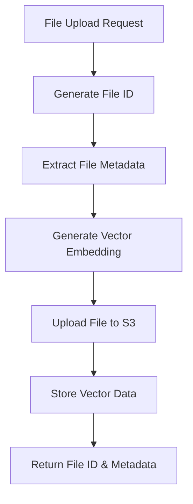
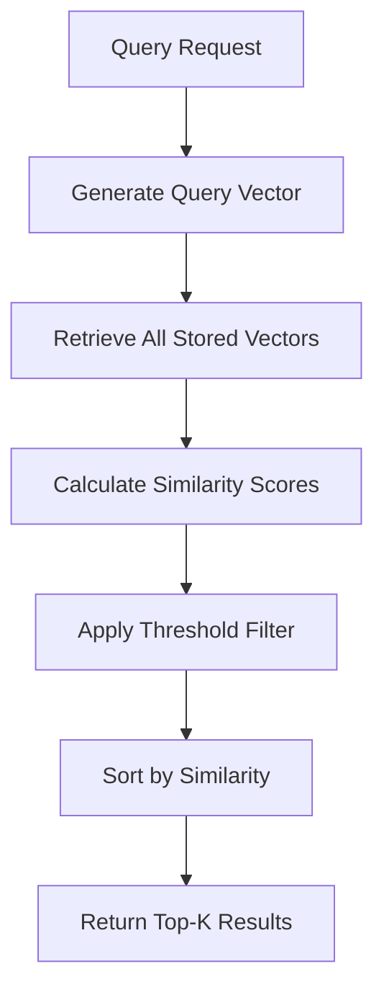

# S3 Vector Service - Codebase Analysis & Technical Documentation

## Table of Contents
- [System Overview](#system-overview)
- [Architecture & Components](#architecture--components)
- [Core Services Deep Dive](#core-services-deep-dive)
- [API Layer](#api-layer)
- [CLI Interface](#cli-interface)
- [Data Models](#data-models)
- [Technology Stack](#technology-stack)
- [Configuration & Setup](#configuration--setup)
- [Workflow Analysis](#workflow-analysis)
- [File Structure](#file-structure)
- [Use Cases](#use-cases)
- [Strengths & Limitations](#strengths--limitations)
- [Recommendations](#recommendations)

---

## System Overview

The S3 Vector Service is a comprehensive file storage and vector similarity search service that combines traditional AWS S3 file storage with machine learning-powered vector embeddings. The system enables semantic search capabilities across uploaded files of various types, making it possible to find similar content based on meaning rather than just metadata.

### Key Capabilities
- **Vector-based file storage** in AWS S3 with automatic embedding generation
- **Semantic similarity search** using cosine similarity calculations
- **Multi-format support** for text, images, and generic files
- **REST API** with comprehensive endpoints
- **CLI interface** for command-line operations
- **Batch processing** for efficient multi-file operations

---

## Architecture & Components

The system follows a layered architecture with clear separation of concerns:

```
┌─────────────────────────────────────────────┐
│                 Client Layer                │
│  (REST API Clients, CLI, Web Interface)    │
└─────────────────┬───────────────────────────┘
                  │
┌─────────────────▼───────────────────────────┐
│              Interface Layer                │
│    (FastAPI REST API, CLI Interface)       │
└─────────────────┬───────────────────────────┘
                  │
┌─────────────────▼───────────────────────────┐
│             Service Layer                   │
│  (S3VectorService, EmbeddingService)       │
└─────────────────┬───────────────────────────┘
                  │
┌─────────────────▼───────────────────────────┐
│            Infrastructure Layer             │
│        (AWS S3, ML Models, Storage)        │
└─────────────────────────────────────────────┘
```

---

## Core Services Deep Dive

### S3VectorService (`app/services/s3vector_service.py`)

**Primary Responsibilities:**
- Orchestrates file uploads with vector generation
- Manages S3 storage operations
- Performs vector similarity searches
- Handles file metadata and lifecycle management

**Key Methods:**
- `upload_file()`: Single file upload with vector generation
- `upload_batch()`: Efficient multi-file processing
- `query_similar()`: Vector similarity search with cosine similarity
- `list_files()`: File enumeration with metadata
- `delete_file()`: Complete file and vector cleanup
- `health_check()`: Service status monitoring

**Storage Architecture:**
```
S3 Bucket Structure:
├── files/
│   └── {file_id}/
│       └── {filename}           # Actual file content
└── vectors/
    └── {file_id}/
        └── embedding.json       # Vector data + metadata
```

**Error Handling:**
- Comprehensive exception handling with detailed logging
- Graceful degradation for unsupported operations
- Rollback mechanisms for failed uploads

### EmbeddingService (`app/services/embedding_service.py`)

**Primary Responsibilities:**
- Converts diverse file types into vector representations
- Provides similarity calculation capabilities
- Manages ML model lifecycle

**File Type Support:**
1. **Text Files** (`.txt`, `.md`, etc.)
   - Direct text content extraction
   - Sentence transformer encoding
   - UTF-8 with fallback to Latin-1 encoding

2. **Image Files** (`.jpg`, `.png`, etc.)
   - PIL-based image processing
   - RGB conversion and standardization
   - Base64 encoding → text embedding (simplified approach)

3. **Generic Files**
   - Fallback text extraction attempts
   - Metadata-based description generation
   - Filename and file size embedding

**Vector Operations:**
- **Model**: `all-MiniLM-L6-v2` (384-dimensional vectors)
- **Similarity**: Cosine similarity calculation
- **Preprocessing**: Text cleaning and truncation
- **Batch Processing**: Efficient multi-text embedding

---

## API Layer

### FastAPI Application (`app/main.py`)

**Service Lifecycle:**
- **Startup**: Automatic S3VectorService initialization
- **Health Monitoring**: Continuous service status tracking
- **Global Exception Handling**: Centralized error management

**Endpoint Specifications:**

| Method | Endpoint | Purpose | Request Model | Response Model |
|--------|----------|---------|---------------|----------------|
| `GET` | `/health` | Service status | None | `HealthResponse` |
| `POST` | `/upload` | Single file upload | `FileUploadRequest` | `UploadResponse` |
| `POST` | `/upload-batch` | Multi-file upload | `BatchUploadRequest` | `BatchUploadResponse` |
| `POST` | `/query` | Similarity search | `QueryRequest` | `QueryResponse` |
| `GET` | `/files` | List files | Query params | `List[FileResponse]` |
| `GET` | `/files/{file_id}` | File details | Path param | `FileResponse` |
| `DELETE` | `/files/{file_id}` | Delete file | Path param | Success message |

**Performance Features:**
- Async/await for I/O operations
- Request/response timing metrics
- Efficient batch processing
- Memory-conscious file handling

---

## CLI Interface

### Command Line Tool (`cli.py`)

**Available Commands:**
```bash
# File Operations
./cli.py upload <file_path> [--metadata <json>]
./cli.py upload-batch <file1> <file2> ... [--metadata <json>]
./cli.py delete <file_id>

# Query Operations  
./cli.py query "<search_text>" [--top-k 5]
./cli.py list [--limit 20]
./cli.py info <file_id>

# Service Operations
./cli.py health
```

**User Experience Features:**
- Rich console output with emojis and colors
- Detailed error messages and suggestions
- JSON metadata support
- Progress indicators for batch operations
- Comprehensive help system

---

## Data Models

### Pydantic Models (`app/models.py`)

**Request Models:**
- `FileUploadRequest`: File path, metadata, content type
- `BatchUploadRequest`: Multiple file upload specifications
- `QueryRequest`: Query vector, similarity parameters

**Response Models:**
- `UploadResponse`: File ID, metadata, performance metrics
- `QueryResponse`: Results with similarity scores and timing
- `FileResponse`: Complete file information
- `HealthResponse`: Service status and capabilities

**Validation Features:**
- Type safety with Pydantic v2
- Field validation and constraints
- Automatic serialization/deserialization
- API documentation generation

---

## Technology Stack

### Core Dependencies
```python
# AWS Integration
boto3>=1.34.0                  # S3 operations

# Machine Learning
sentence-transformers>=2.2.0   # Text embeddings
numpy>=1.24.0                  # Vector operations

# Web Framework
fastapi>=0.104.0               # REST API
uvicorn>=0.24.0                # ASGI server
pydantic>=2.5.0                # Data validation

# Image Processing
Pillow>=10.0.0                 # Image handling

# Utilities
python-dotenv>=1.0.0           # Environment management
requests>=2.31.0               # HTTP client
```

### ML Model Details
- **Default Model**: `all-MiniLM-L6-v2`
- **Vector Dimension**: 384
- **Similarity Metric**: Cosine similarity
- **Performance**: ~1000 embeddings/second on modern CPU

---

## Configuration & Setup

### Environment Variables
```bash
# Required
S3_BUCKET_NAME=your-vector-bucket
AWS_ACCESS_KEY_ID=your-access-key
AWS_SECRET_ACCESS_KEY=your-secret-key

# Optional
AWS_REGION=us-east-1
EMBEDDING_MODEL=all-MiniLM-L6-v2
HOST=0.0.0.0
PORT=8000
DEBUG=false
```

### AWS Requirements
1. **S3 Vector Bucket** with vector search capabilities enabled
2. **IAM Permissions** for S3 operations (GetObject, PutObject, DeleteObject, ListBucket)
3. **Vector Configuration**: 384-dimensional vectors, cosine similarity
4. **Network Access** from deployment environment

---

## Workflow Analysis

### File Upload Flow


### Similarity Search Flow


### Error Recovery
- **Partial Upload Failures**: Automatic cleanup of incomplete uploads
- **Vector Generation Errors**: Fallback to metadata-based descriptions
- **S3 Connectivity Issues**: Retry logic with exponential backoff
- **Model Loading Failures**: Graceful service degradation

---

## File Structure

```
s3vector/
├── app/                        # Core application
│   ├── __init__.py
│   ├── main.py                 # FastAPI application entry point
│   ├── models.py               # Pydantic data models
│   └── services/               # Business logic layer
│       ├── __init__.py
│       ├── embedding_service.py # ML embedding generation
│       └── s3vector_service.py  # S3 operations & orchestration
├── tests/                      # Test suite
│   ├── __init__.py
│   └── test_s3vector_service.py
├── documents/                  # Technical documentation
│   └── codebase-analysis.md
├── cli.py                      # Command-line interface
├── example.py                  # Usage examples
├── run_tests.py               # Test runner
├── requirements.txt           # Python dependencies
├── setup.py                   # Package configuration
├── README.md                  # User documentation
├── env.example                # Environment template
├── Dockerfile                 # Container definition
├── docker-compose.yml         # Multi-service orchestration
└── docker-compose.dev.yml     # Development environment
```

---

## Use Cases

### 1. Document Search System
- **Scenario**: Legal firm with thousands of case documents
- **Implementation**: Upload PDFs → semantic search by legal concepts
- **Benefit**: Find relevant cases by meaning, not just keywords

### 2. Media Asset Management
- **Scenario**: Marketing agency with image/video libraries
- **Implementation**: Store media files → similarity search for content reuse
- **Benefit**: Discover similar assets for campaign consistency

### 3. Knowledge Base
- **Scenario**: Technical documentation repository
- **Implementation**: Index articles → contextual search capabilities
- **Benefit**: Users find relevant information through natural language queries

### 4. Content Recommendation
- **Scenario**: Educational platform with learning materials
- **Implementation**: Vector-based content similarity → personalized recommendations
- **Benefit**: Improved learning paths based on content relationships

---

## Strengths & Limitations

### Strengths ✅

**Architecture:**
- Clean separation of concerns with service-oriented design
- Comprehensive error handling and logging
- Production-ready with health monitoring
- Scalable batch processing capabilities

**User Experience:**
- Dual interface (REST API + CLI) for different use cases
- Rich documentation and examples
- Intuitive command structure
- Detailed error messages

**Technical:**
- Type-safe implementation with Pydantic
- Async/await for performance
- Configurable ML models
- Docker support for deployment

### Limitations ⚠️

**Vector Quality:**
- Image embeddings use simplified base64 approach
- Limited support for complex document formats (PDF, Word)
- Single embedding model limits domain specialization

**Scalability:**
- Linear search through all vectors (no indexing)
- In-memory vector loading for large datasets
- No distributed processing capabilities

**Security:**
- No authentication/authorization mechanisms
- Limited input validation for file types
- No encryption for sensitive content

**Operational:**
- Single point of failure (no redundancy)
- No caching mechanisms
- Limited monitoring and alerting

---

## Recommendations

### Immediate Improvements (Short Term)

1. **Enhanced Vector Quality**
   ```python
   # Add specialized models for different content types
   - Text: sentence-transformers/all-mpnet-base-v2
   - Images: CLIP (clip-vit-base-patch32)
   - Code: microsoft/codebert-base
   ```

2. **Input Validation**
   ```python
   # Add file type validation and size limits
   - Maximum file size constraints
   - Allowed file type whitelist
   - Content sanitization
   ```

3. **Caching Layer**
   ```python
   # Cache frequently accessed embeddings
   - Redis for embedding cache
   - LRU eviction policy
   - Cache warming strategies
   ```

### Medium Term Enhancements

1. **Vector Database Integration**
   - Replace linear search with Pinecone/Weaviate/Milvus
   - Add approximate nearest neighbor (ANN) indexing
   - Support for filtered searches

2. **Advanced Document Processing**
   - PDF text extraction with layout preservation
   - Office document format support
   - OCR for scanned documents

3. **Authentication & Security**
   - JWT-based authentication
   - Role-based access control
   - File encryption at rest

### Long Term Vision

1. **Multi-Modal Search**
   - Cross-modal queries (text → image, image → text)
   - Advanced fusion techniques
   - Custom model fine-tuning

2. **Distributed Architecture**
   - Microservices decomposition
   - Horizontal scaling capabilities
   - Multi-region deployment

3. **Advanced Analytics**
   - Search analytics and insights
   - Content clustering and categorization
   - Recommendation engines

---

## Conclusion

The S3 Vector Service represents a well-architected solution for vector-based file storage and similarity search. The codebase demonstrates strong software engineering practices with clear separation of concerns, comprehensive error handling, and production-ready features.

The system successfully bridges traditional file storage with modern ML capabilities, providing both API and CLI interfaces for diverse use cases. While there are opportunities for enhancement in vector quality, scalability, and security, the foundation is solid and extensible.

This service would be particularly valuable for organizations looking to add semantic search capabilities to their document management workflows, content discovery systems, or knowledge bases.

---

**Document Version**: 1.0  
**Last Updated**: December 2024  
**Analysis Based On**: Complete codebase review including all core modules, services, and interfaces 